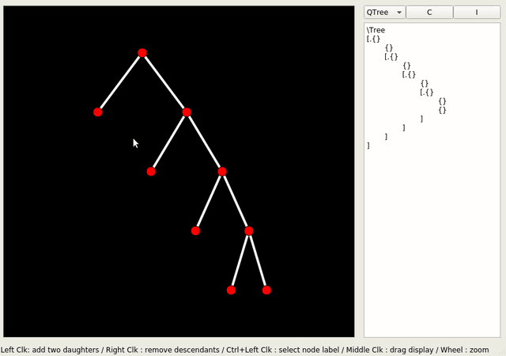

Shajara
=================

Shajara allows you to draw your trees in a simple GUI. The tree is then automatically converted to a string representation for QTree, forest and other LateX tree-drawing packages.
(It is a port of the earlier TreeMaker to Qt, with a lot of improvements)




# Requirements

 - Python 3
 - PyQt5

# Use
	
In the display:
   - Left Click   on node to insert daughter nodes or sisters
   - Right Click  on node to remove node's daughters
   - Middle Click (i.e. wheel click) to drag display 
   - Mouse Wheel to zoom in and out
   - Ctrl+Left Click to select node's label in the text field on the right

In the text field:
   - Press Enter to copy to clipboard
   - Press Tab to move to next node (next in the sense of reverse Polish notation, i.e. ascendants follow descendants)

Buttons:
   - C : clear node labels
   - I : if you copied a string representation of a tree from another program, imports the tree into Shajara (only QTree for now).

# Options

Two customizations files are available in the "options/" folder. They are "options/style/style.json" (for tree display style) and "options/behavior/behavior.json" (for button mapping, experimental).


# Installation

## Manually

Simply save "src/" from the current repository on your computer. After checking that the Python packages listed in Requirements above are installed, go to the folder you copied the files to and run:

```bash
python main.py
```

## Windows

TODO

## Linux

TODO